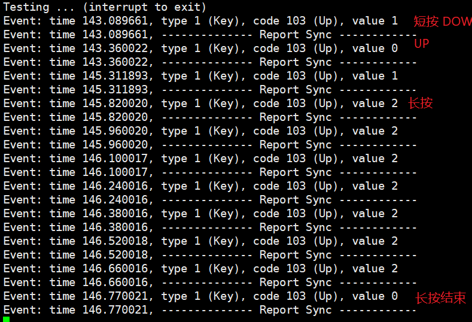

## Linux下的gpio-rc驱动调试
> 由于hi3518ev300没有IR模块，SDK中没有提供红外驱动，所以需要用GPIO
	平台：hi3518ev300+linux-4.9.37
	红外编码：NEC
----------------------------------
### 在内核中配置rc驱动
	主要是这两个文件 rc-main.c、rc-ir-raw.c rc-core.c 编译进内核\
	### 配置内核
		Device Drivers --->
			<*> Multimedia support
				[*] Remote Controller support
				*** Media drivers ***
				[ ] Remote controller decoders
	
	*注意* 由于解码需要修改所以就不静态编译进内核了

### 所需文件
	1.路径
		linux-4.9.y\drivers\media\rc
	2.文件
		ir-nec-decoder.c 
		gpio-ir-recv.c

## 修改代码

### 1、设备树dts修改
	在设备树文件 hi3518ev300-demb.dts，添加ir_recv节点：
	ir_recv: gpio-ir-receiver {                                                                                                                                                                             
		compatible = "gpio-ir-receiver";
		gpios = <&gpio_chip0 0 1>; 
		active_low = <1>;
		linux,rc-map-name = "rc-hx18380-carmp3";
		allowed_protos = <0x100>; /*NEC protocol*/
	};

### 2、修改解码程序ir-nec-decoder.c
	参考具体修改完成文件 ir-hx1838-decoder
		*注意*
			196. scancode = address << 8 | command;
			205. rc_keydown(dev, rc_type, scancode, 0);
			上报的为一个u32类型，且扫描码为 地址码+命令码 共两个字节
### 3.修改gpio-ir-recv.c
	添加键盘映射等

### 4.修改rc-main.c
		(1) 去掉多余的上报
		/**
		 * ir_do_keydown() - internal function to process a keypress
		 * @dev:	the struct rc_dev descriptor of the device
		 * @protocol:	the protocol of the keypress
		 * @scancode:   the scancode of the keypress
		 * @keycode:    the keycode of the keypress
		 * @toggle:     the toggle value of the keypress
		 *
		 * This function is used internally to register a keypress, it must be
		 * called with keylock held.
		 */
		static void ir_do_keydown(struct rc_dev *dev, enum rc_type protocol,
					  u32 scancode, u32 keycode, u8 toggle)
		{
			bool new_event = (!dev->keypressed		 ||
					  dev->last_protocol != protocol ||
					  dev->last_scancode != scancode ||
					  dev->last_toggle   != toggle);
	
			if (new_event && dev->keypressed)
				ir_do_keyup(dev, false);
	
			//input_event(dev->input_dev, EV_MSC, MSC_SCAN, scancode);
	
			//pr_err("wwww->%d, %d\n", new_event, keycode);
			if (new_event && keycode != KEY_RESERVED) {
				/* Register a keypress */
				dev->keypressed = true;
				dev->last_protocol = protocol;
				dev->last_scancode = scancode;
				dev->last_toggle = toggle;
				dev->last_keycode = keycode;
	
				/*IR_dprintk(1, "%s: key down event, "
					   "key 0x%04x, protocol 0x%04x, scancode 0x%08x\n",
					   dev->input_name, keycode, protocol, scancode);*/
				//pr_err("enter\n");
				input_report_key(dev->input_dev, keycode, 1);
				//pr_err("exit\n");
				//led_trigger_event(led_feedback, LED_FULL);
			}
	
			input_sync(dev->input_dev);
		}
	
		(2) 修改上报的重复码
		/**
		 * rc_repeat() - signals that a key is still pressed
		 * @dev:	the struct rc_dev descriptor of the device
		 *
		 * This routine is used by IR decoders when a repeat message which does
		 * not include the necessary bits to reproduce the scancode has been
		 * received.
		 */
		void rc_repeat(struct rc_dev *dev)
		{
			unsigned long flags;
			//wwp add 重复码上报
			u32 keycode = rc_g_keycode_from_table(dev, dev->last_scancode);
			
			spin_lock_irqsave(&dev->keylock, flags);
	
			//input_event(dev->input_dev, EV_MSC, MSC_SCAN, dev->last_scancode);
			input_event(dev->input_dev, EV_REP, keycode, 2);
			input_sync(dev->input_dev);
	
			if (!dev->keypressed)
				goto out;
	
			dev->keyup_jiffies = jiffies + msecs_to_jiffies(IR_KEYPRESS_TIMEOUT);
			mod_timer(&dev->timer_keyup, dev->keyup_jiffies);
	
		out:
			spin_unlock_irqrestore(&dev->keylock, flags);
		}

### Makefile文件
	KERN_DIR=/*/linux-4.9.y
	CUR_DIR=$(shell pwd)
	OUT_PUT_DIR=$(CUR_DIR)/out
	
	obj-m += gpio-ir-recv.o
	obj-m += ir-hx1838-decoder.o
	
	test_app_name = evtest
	tets_app_src = evtest.c
	CC = arm-himix100-linux-gcc
	INC_PATH +=
	CFLAGS +=
	LDFLAGS += -pthread
	
	all:
		@ if [ ! -d ${OUT_PUT_DIR}  ]; then  mkdir -p ${OUT_PUT_DIR}; fi
		make -C $(KERN_DIR) M=$(CUR_DIR) modules V=1
		$(CC) $(INC_PATH) $(CFLAGS) $(LDFLAGS) $(tets_app_src)  -o $(test_app_name) 
		cp *.ko   $(test_app_name) ${OUT_PUT_DIR}
	
	.PHONY:clean
	clean:
		make  -C $(KERN_DIR) M=$(CUR_DIR)  modules clean
		rm ${OUT_PUT_DIR}/* $(test_app_name) -rf

### 编译
	/* 编译 */
	make ARCH=arm CROSS_COMPILE=arm-himix100-linux- all
	/* 清除 */
	make ARCH=arm CROSS_COMPILE=arm-himix100-linux- clean

### 测试
	在开机启动脚本加载程序
		# 加载驱动
		cd /tmp/ir
		insmod gpio-ir-recv.ko
		insmod ir-hx1838-decoder.ko
		
		# 运行测试app
		./evtest /dev/input/evevt0

测试结果：

​	
​	